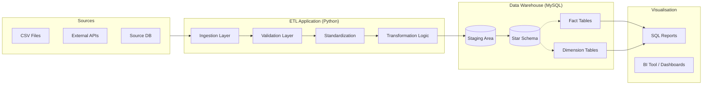

# 🚀 Data Engineering Hackathon Repository


## 📌 Project Overview
This repository serves as the **Data Engineering Backbone** for our hackathon solution. It contains reusable pipelines for Ingestion, Validation, Transformation, and Modeling.

**Objective**: Build a scalable, fault-tolerant Data Warehouse to answer complex business queries under 8 hours.

---

## 🏗 Architecture
We follow a **Modular ETL** approach feeding into a **Star Schema** Data Warehouse.



### Why Star Schema?
We chose **Star Schema** over OBT (One Big Table) because:
1.  **Engineering Maturity**: Demonstrates understanding of Dimensional Modeling (Facts vs Dimensions).
2.  **Flexibility**: Allows SCD Type 2 tracking (history of changes) for Dimensions like Customer/Policy.
3.  **Efficiency**: Reduces redundancy (normalization) while maintaining high query performance.

---

## 🛠 Setup Instructions (Sprint 0)

1.  **Clone the Repo**:
    ```bash
    git clone https://github.com/bennychainik/DE-Hackathon_Trinity.git
    cd DE-Hackathon_Trinity
    ```

2.  **Create Environment**:
    ```bash
    python -m venv venv
    # Windows
    .\venv\Scripts\Activate
    # Mac/Linux
    source venv/bin/activate
    ```

3.  **Install Dependencies**:
    ```bash
    pip install -r requirements.txt
    ```

4.  **Verify Setup**:
    ```bash
    python verify_setup.py
    ```

---

## 📁 Repository Structure
| Folder | Purpose |
|:-------|:--------|
| `src/ingestion.py` | Universal readers for CSV, Excel, SQL. |
| `src/validation.py` | Data Quality checks (Nulls, Integrity). |
| `src/transformation.py` | Joins, Aggregations, SCD logic. |
| `sql/ddl/` | CREATE TABLE scripts for DWH. |
| `sql/reporting/` | SQL Analysis templates (Window funcs, CTEs). |
| `docs/` | Architecture, Governance, and Data Diagrams. |

---

## 👥 Team Roles
- **@IngestionLead**: Data Loading, Cleaning, Validation.
- **@ModelingLead**: DWH Design, DDLs, Transformation Logic.
- **@ReportingLead**: SQL Queries, Documentation, Final Presentation.

---

*Generated by DE-Prep-Assistant | Ready for Hackathon*
