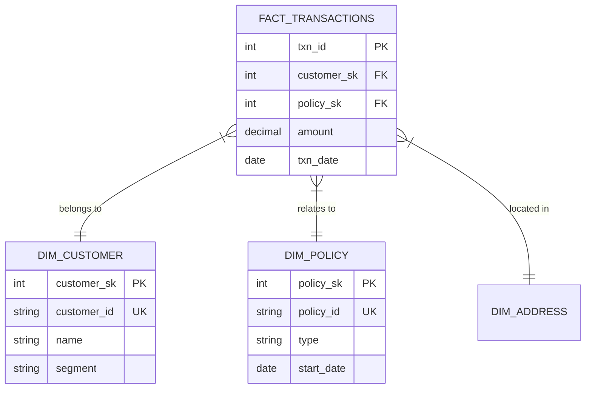

# Data Modeling Strategy

## Architecture: Star Schema
We utilize a **Star Schema** approach for the Data Warehouse to optimize for:
1.  **Read Performance**: Simplified joins for reporting.
2.  **Scalability**: Easy to add new dimensions.
3.  **Simplicity**: Queries are intuitive for analytics.

## Entity Relationship Diagram (ERD) Concept

## Best Practices
- **Surrogate Keys (SK)**: Always use Auto-Increment Integer SKs for joins. Never join on string business IDs if possible.
- **SCD Strategy**:
    - **Dimensions**: Type 1 (Overwrite) for corrections, Type 2 (History) for status changes (e.g., Policy Status).
    - **Facts**: Transactional (Append-only).
