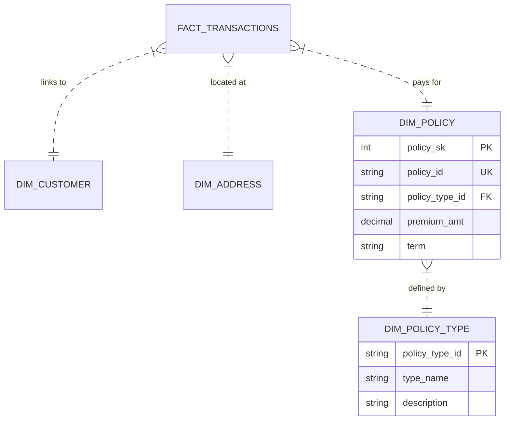

# Data Modeling Strategy

## Architecture: Hybrid (Star + Snowflake)
We utilize a **Hybrid Schema** to balance performance with data quality. 

### Why Hybrid?
The source data contains 26 columns with distinct hierarchies. We apply **Snowflaking** (Normalization) specifically to the **Policy** dimension to separate the **Contract** (Policy Instance) from the **Product** (Policy Type).

### Entity Relationship Diagram (ERD)

### Benefits for Hackathon
1.  **Redundancy Reduction**: `Policy_Type_Desc` is not repeated for every customer.
2.  **Cleaner Updates**: If a Policy Type description changes, we update ONE row in `dim_policy_type`.
3.  **Logical Separation**: Differentiates between what the customer *owns* (Contract) and what we *sell* (Product).
