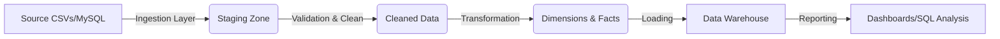

# Pipeline Architecture

## Layers
1. **Ingestion**: Raw data landing. Code: `src/ingestion.py`.
2. **Validation**: Quality Checks (Nulls, Dupes). Code: `src/validation.py`.
3. **Transformation**: Business Logic & Modeling. Code: `src/transformation.py`.
4. **Storage**: MySQL Star Schema. Schema: `sql/ddl/init_schema_mysql.sql`.
